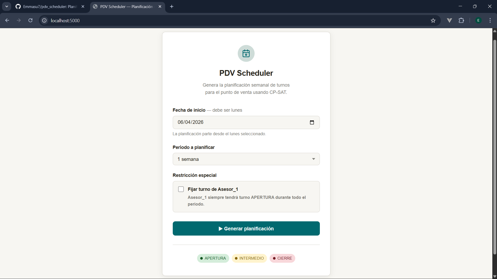
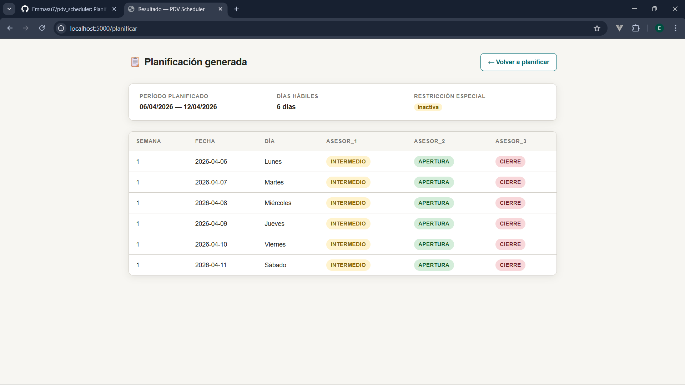
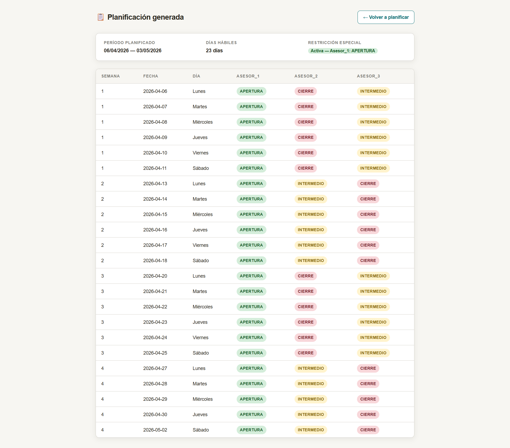

# PDV Scheduler — Planificación de Turnos con CP-SAT

Aplicación Python + Flask que resuelve la asignación óptima de turnos para un
Punto de Venta (PDV) usando el solver **CP-SAT de OR-Tools**. El sistema genera
una planificación semanal o mensual para 3 asesores (APERTURA, INTERMEDIO y
CIERRE), respetando días hábiles colombianos y un conjunto de restricciones
duras de negocio.

## Descripción del proyecto

El PDV Scheduler automatiza la planificación de turnos de un equipo de 3
asesores en un Punto de Venta. El usuario selecciona la fecha de inicio, el
período de planificación y si desea activar el turno fijo de `Asesor_1`; el
backend resuelve el problema con programación por restricciones y devuelve la
planificación en una tabla HTML con colores por turno.

**Características principales:**

- Resolución exacta con CP-SAT (sin heurísticas ni fuerza bruta)
- Soporte para 1 semana o (hasta 1 mes)
- Exclusión automática de domingos y festivos colombianos (`holidays`)
- Rotación semanal automática cuando `semanas > 1`
- Restricción opcional de turno fijo para `Asesor_1` (siempre en APERTURA)
- Tabla HTML con colores por turno generada con Flask + Jinja2

## Instalación

**Requisitos previos:** 

Python 3.11 o superior.

```bash
# 1. Clonar el repositorio
git clone https://github.com/Emmasu7/pdv_scheduler.git
cd pdv_scheduler

# 2. Crear entorno virtual (recomendado)
python -m venv .venv
source .venv/bin/activate        # Linux / macOS
.venv\Scripts\activate           # Windows

# 3. Instalar dependencias
pip install -r requirements.txt
```

**Contenido de `requirements.txt`:**

```
Flask==3.1.1
holidays==0.54
ortools==9.12.4544
pandas==2.2.3
```


## Ejecución

```bash
python app.py
```

Abrir en el navegador: [http://localhost:5000]

El formulario del index permite configurar:

- **Fecha de inicio** — debe ser lunes; la planificación parte desde ese día
- **Período a planificar** — 1 semana o 1 mes (4 semanas)
- **Restricción especial** — checkbox opcional: `Asesor_1` siempre tendrá turno APERTURA durante todo el período (activa R6 + R7)

> Los asesores se llaman `Asesor_1`, `Asesor_2` y `Asesor_3` de forma predeterminada.
> Para cambiar los nombres, modifique la constante `ASESORES` en `app.py`.

## Modelo CP-SAT: teoría y uso

### ¿Qué es CP-SAT?

**CP-SAT** (*Constraint Programming + SAT*) es el solver de optimización
combinatoria de Google incluido en la librería **OR-Tools**. Combina dos
paradigmas:

- **Constraint Programming (CP):** se declaran variables y restricciones
  lógicas; el solver explora el espacio de soluciones y encuentra una que las
  satisfaga todas.
- **SAT (Boolean Satisfiability):** técnicas de resolución booleana que hacen
  la búsqueda extremadamente eficiente incluso con miles de variables.

La idea central es que **se define el problema, no el algoritmo**. En lugar de
programar *cómo* buscar la solución, se declara *qué condiciones debe cumplir*
una solución válida.

### Cómo se usó en este proyecto

Para cada tripleta `(asesor, día_hábil, turno)` se crea una **variable booleana**
`x[a, d, t]` que vale `1` cuando el asesor `a` trabaja el turno `t` en el día
`d`, y `0` en caso contrario. El solver CP-SAT determina los valores de todas
las variables respetando las restricciones duras declaradas.

```python
# Ejemplo de creación de variable
x[a, d, t] = modelo.new_bool_var(f"turno_a{a}_d{d}_t{t}")

# Ejemplo de restricción: exactamente un turno por asesor por día
modelo.add_exactly_one(x[a, d, t] for t in range(len(TURNOS)))
```

### Restricciones implementadas (R1–R7)

Resumen de activación:

| ID | Nombre | Activación |
|----|--------|------------|
| R1 | Un turno por asesor por día | Siempre |
| R2 | Cobertura total | Siempre |
| R3 | Consistencia semanal | Siempre |
| R4 | Solo días hábiles | Siempre |
| R5 | Rotación semanal | Automática cuando `semanas > 1` |
| R6 | Turno fijo para `Asesor_1` | Opcional (checkbox en el formulario) |
| R7 | Rotación binaria de asesores libres | Opcional (requiere R6) |

**R1 — Un turno por asesor por día**  
Usa `add_exactly_one` sobre los turnos de un asesor en un día hábil. Impide que un asesor tenga dos turnos al mismo tiempo.

**R2 — Cobertura total**  
Usa `add_exactly_one` sobre los asesores para cada turno en cada día. Ningún turno queda sin cubrir.

**R3 — Consistencia semanal**  
El asesor conserva el mismo turno toda la semana. Se fija un `dia_ref` (primer día hábil de la semana) y se igualan las variables del resto de días al representante.

**R4 — Solo días hábiles**  
Se excluyen domingos (`weekday() == 6`) y festivos colombianos detectados con `holidays.Colombia()`. No se crean variables para esos días.

**R5 — Rotación semanal**  
Un asesor no puede repetir el mismo turno en semanas consecutivas:

```python
x[a, dia_ref_W, t] + x[a, dia_ref_{W+1}, t] <= 1
```

`Asesor_1` se excluye de R5 cuando R6 está activa para evitar infeasibility.

**R6 — Turno fijo para `Asesor_1`**  
Fuerza `x[Asesor_1, d, APERTURA] = 1` para todos los días hábiles. El solver redistribuye INTERMEDIO y CIERRE entre `Asesor_2` y `Asesor_3`.

**R7 — Rotación binaria de asesores libres**  
`Asesor_2` y `Asesor_3` intercambian sus turnos (INTERMEDIO ↔ CIERRE) en semanas consecutivas. Requiere R6 activa.

---


## DataFrame generado

El método `obtener_dataframe()` retorna un `pd.DataFrame` con las siguientes
columnas:

| Columna | Tipo | Descripción |
|---------|------|-------------|
| `Semana` | `int` | Número de semana secuencial dentro del período (empieza en 1) |
| `Fecha` | `str` | Fecha del día hábil en formato `YYYY-MM-DD` |
| `Día` | `str` | Nombre del día en español (`Lunes`, `Martes`, … `Sábado`) |
| `<Asesor_1>` | `str` | Turno asignado al primer asesor: `APERTURA`, `INTERMEDIO` o `CIERRE` |
| `<Asesor_2>` | `str` | Turno asignado al segundo asesor |
| `<Asesor_3>` | `str` | Turno asignado al tercer asesor |

> Las columnas de asesores son **dinámicas**: sus nombres corresponden
> exactamente a los valores de la lista `asesores` pasada al constructor.

**Ejemplo de salida (1 semanas, Asesor_1 fijo en APERTURA):**

```
 Semana      Fecha        Día     Asesor_1     Asesor_2     Asesor_3
      1 2026-04-06      Lunes     APERTURA       CIERRE   INTERMEDIO
      1 2026-04-07     Martes     APERTURA       CIERRE   INTERMEDIO
      1 2026-04-08  Miércoles     APERTURA       CIERRE   INTERMEDIO
      1 2026-04-09      Jueves    APERTURA       CIERRE   INTERMEDIO
      1 2026-04-10    Viernes     APERTURA       CIERRE   INTERMEDIO
      1 2026-04-11     Sábado     APERTURA       CIERRE   INTERMEDIO
```

***

## Parámetros del constructor `PDVScheduler`

```python
PDVScheduler(
    asesores: list[str],
    fecha_inicio: date,
    semanas: int = 1,
    aplicar_restriccion_asesor_fijo: bool = False,
    asesor_fijo: str | None = None,
    turno_fijo: str = "APERTURA",
)
```

| Parámetro | Tipo | Requerido | Por defecto | Descripción |
|-----------|------|-----------|-------------|-------------|
| `asesores` | `list[str]` | ✅ | — | Nombres de los asesores. Debe tener exactamente 3 elementos (uno por turno). |
| `fecha_inicio` | `date` | ✅ | — | Primer día del período de planificación (inclusive). |
| `semanas` | `int` | ❌ | `1` | Número de semanas a planificar. Mínimo `1`. La fecha de fin se calcula como `fecha_inicio + timedelta(weeks=semanas) - 1 día`. |
| `aplicar_restriccion_asesor_fijo` | `bool` | ❌ | `False` | Si `True`, activa R6 (turno fijo) y R7 (rotación binaria). Requiere `asesor_fijo` definido. |
| `asesor_fijo` | `str \| None` | Condicional | `None` | Nombre del asesor con turno fijo. Obligatorio cuando `aplicar_restriccion_asesor_fijo=True`. Debe existir en `asesores`. |
| `turno_fijo` | `str` | ❌ | `"APERTURA"` | Turno asignado permanentemente a `asesor_fijo`. Valores válidos: `"APERTURA"`, `"INTERMEDIO"`, `"CIERRE"`. |

**Errores que lanza el constructor:**

- `TypeError` — si `fecha_inicio` no es `datetime.date`.
- `ValueError` — lista `asesores` vacía, longitud incorrecta, `turno_fijo` inválido,
  `semanas < 1`, `asesor_fijo` ausente o inexistente con R6 activa, o sin días
  hábiles en el rango calculado.
- `RuntimeError` — si el solver CP-SAT lanza una excepción inesperada al llamar
  a `resolver()`.

***

## Estructura del repositorio

```
pdv-scheduler/
│
├── app.py                  ← Servidor Flask: rutas GET / y POST /planificar
├── scheduler.py            ← Clase PDVScheduler con CP-SAT (lógica pura)
├── requirements.txt        ← Dependencias del proyecto
├── README.md               ← Esta documentación
│
└── templates/
    ├── index.html          ← Formulario de bienvenida con botón de ejecución
    └── resultado.html      ← Tabla HTML de planificación con colores por turno
```

> **Separación de responsabilidades:** `scheduler.py` no importa Flask;
> `app.py` no contiene lógica del solver. Cada módulo tiene una única
> responsabilidad.

***

## Screenshots

### Formulario principal


### Planificación sin turno fijo (1 semana)


### Planificación con Asesor_1 fijo en APERTURA (2+ semanas — R6 + R7 activas)



## Autor
**Emmanuel Seguro Urrego**

[LinkedIn](https://www.linkedin.com/in/emmanuel-seguro)

[GitHub](https://github.com/Emmasu7)

Desarrollado como prueba técnica de planificación de turnos PDV con CP-SAT para redy.
